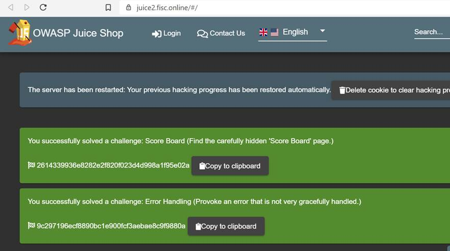

### Como crear un CTF con Owasp Juice Shop y Traefik 

Durante toda mi aventura con owasp juice shop he realizado eventos de ctf para poner en práctica todos nuestros conocimientos en pentesting web. El proceso de configurar los servicios, aplicación, dominios puede llevarte horas de implementación. 

Me gustaría compartir a la comunidad de owasp como implementar con Docker-compose y traefik un ambiente de CTF automatizado utilizando esta aplicación y otras como wordpress o aplicaciones vulnerables como DWVA, etc.

 

#### **Requisitos para el ambiente**

Para seguir este tutorial, necesitarás lo siguiente:

·    Un servidor (Ubuntu,Debian) que podemos ubicarlos en aws o vurlt.com, para este ambiente de laboratorio hemos utilizado vultr.com. 

·    Docker instalado en su servidor, https://www.digitalocean.com/community/tutorials/how-to-install-and-use-docker-on-debian-9 

·    Docker Compose instalado, https://www.digitalocean.com/community/tutorials/how-to-install-docker-compose-on-debian-9 

·    Un dominio y los registros para cado unos de nuestro ambiente, que cada uno apunta a la dirección IP de el servidor.

**Pero antes de comenzar a configurar nuestro ambiente de CTF definíamos algunos conceptos**. 

**¿Qué es Traefik?**

Traefik es una herramienta Open Source desarrollada en Go, usada para el balanceo de cargas y como reverse proxy, una de las principales características de esta herramienta, es que es está orientada a microservicios ya que tiene integración directa con proveedores tales como docker, kubenertes docker swarm entre otros.

 

 

A través de traefik vamos a lograr automatizar nuestros dominios con certificados de Lets Encrypt para cada uno de nuestros ambientes de Owasp Juice Shop que se los haremos llegar a cada uno de nuestro participante. 

##### **Configuramos nuestro traefik.** 

Utilizamos el proyecto oficial de traefik en Docker https://hub.docker.com/_/traefik para su configuración. 

Pero antes de que pongamos en marcha nuestro contenedor de Traefik, necesitamos crear un archivo de configuración y establecer una contraseña encriptada para poder acceder al panel de control. 

Usaremos la utilidad htpasswd para crear esta contraseña encriptada. Primero, instalaremos la utilidad, que está incluida en el paquete apache2-utils:

·    sudo apt install apache2-utils

·    htpassw -nb admin:PASSWORD

 

·    Salida del resultado

·    admin:$apr1$ruca84Hq$mbjdMZBAG.KWn7vfN/SNK/

 

Para configurar el servidor de Traefik, crearemos un nuevo archivo de configuración llamado traefik.toml usando el formato TOML; es un lenguaje de configuración similar a los archivos INI, pero estandarizado. Este archivo nos permite configurar el servidor de Traefik y varias integraciones, o proveedores, que queramos utilizar. En este tutorial, utilizaremos tres de los proveedores disponibles de Traefik: api, docker y acme, que se utiliza para soportar TLS utilizando Let's Encrypt.

**Contenido del archivo traefik.toml**

defaultEntryPoints = ["http", "https"]

[entryPoints]

 [entryPoints.dashboard]

  address = ":8080"

  [entryPoints.dashboard.auth]

   [entryPoints.dashboard.auth.basic]

​    users = ["admin: $apr1$LrZ7NOjP$/jqzap/h/XTN4YNMejd311"]

 

 

 

[entryPoints.http]

  address = ":80"

   [entryPoints.http.redirect]

​    entryPoint = "https"

 [entryPoints.https]

  address = ":443"

   [entryPoints.https.tls]

[api]

entrypoint="dashboard"

[acme]

email = "correo"

storage = "acme.json"

entryPoint = "https"

onHostRule = true

 [acme. httpChallenge]

 entryPoint = "http"

[docker]

domain = "dominio"

watch = true

network = "web"

 

Antes de iniciar nuestro contenedor creamos una red para el proxy pueda compartirla con los contenedores. La red de Docker es necesaria para que podamos usarla con aplicaciones que se ejecuten usando Docker compose. **Nombre de nuestra red es Web.**

·    **Comando de ejecución:** docker network creater web (comando para crear nuestra red)

Cuando el contenedor de Traefik empiece, lo añadiremos a esta red. Entonces podremos añadir más contenedores a esta red más tarde para que Traefik se procure.

 

 

A continuación, crearemos un archivo vacío que contendrá nuestra información de Let's Encrypt. Compartiremos esto en el contenedor para que Traefik pueda usarlo:

·    Touch acmé.json

Traefik sólo podrá usar este archivo si el usuario raíz dentro del contenedor tiene un acceso único de lectura y escritura a él. Para ello, bloquea los permisos de acme.json para que sólo el propietario del archivo tenga permiso de lectura y escritura.

·    Chmod 600 acme.json 

Iniciamos finalmente nuestro contenedor traefik con los siguientes comandos: 

docker run -d \

 -v /var/run/docker.sock:/var/run/docker.sock \

 -v $PWD/traefik.toml:/traefik.toml \

 -v $PWD/acme.json:/acme.json \

 -p 80:80 \

 -p 443:443 \

 -l traefik.frontend.rule=Host:monitor.your_domain \

 -l traefik.port=8080 \

 --network web \

 --name traefik \

 traefik:1.7.6-alpine

 

Detalles del comando ejecutado para iniciar traefik: 

·    Mapeamos los puertos 80 y 443 de nuestro host Docker a los mismos puertos del contenedor de Traefik para que Traefik reciba todo el tráfico HTTP y HTTPS al servidor.

·    Luego configuramos dos etiquetas Docker que le dicen a Traefik que dirija el tráfico al nombre de host monitor.su_dominio al puerto 8080 dentro del contenedor de Traefik, exponiendo el tablero de monitoreo.

·    Configuramos la red del contenedor a la web, y le damos el nombre de Traefik al contenedor.

·    Finalmente, usamos la imagen traefik:1.7.6-alpine para este contenedor, porque es pequeño.

·    Con el contenedor iniciado, ahora tienes un tablero al que puedes acceder para ver los dominios de los contenedores. También puedes usar este tablero para visualizar los frontends y backends que Traefik ha registrado. Acceda al tablero de monitoreo apuntando su navegador a https://monitor.your_domain. Se le pedirá su nombre de usuario y contraseña, que son admin y la contraseña que configuró en el paso 1.

Ahora para registrar nuestros Owasp Juice Shop con traefik necesitamos crear un Docker compose con las siguientes especificaciones. 

 

version: "3"

networks:

 web:

 external: true

 internal:

 external: false

services:

 dark:

 image: wordpress:4.9.8-apache

 environment:

  WORDPRESS_DB_PASSWORD:

 labels:

  \- traefik.backend=dark

  \- traefik.frontend.rule=Host:sic.fisc.online

  \- traefik.docker.network=web

  \- traefik.port=80

 networks:

  \- internal

  \- web

 depends_on:

  \- mysql

 mysql:

 image: mysql:5.7

 environment:

  MYSQL_ROOT_PASSWORD:

 networks:

  \- internal

 labels:

  \- traefik.enable=false

 adminer:

 image: adminer:4.6.3-standalone

 labels:

  \- traefik.backend=adminer

  \- traefik.frontend.rule=Host:db-admin.fisc.online

  \- traefik.docker.network=web

  \- traefik.port=8080

 networks:

  \- internal

  \- web

 depends_on:

  \- mysql

 owasp:

 image: bkimminich/juice-shop:v8.7.2

 environment:

  NODE_ENV:

 labels:

  \- traefik.backend=owasp

  \- traefik.frontend.rule=Host:juice1.fisc.online

  \- traefik.docker.network=web

  \- traefik.port=3000

 networks:

  \- web

 owasp2:

 image: bkimminich/juice-shop:v8.7.2

 environment:

  NODE_ENV:

 labels:

  \- traefik.backend=owasp2

  \- traefik.frontend.rule=Host:juice2.fisc.online

  \- traefik.docker.network=web

  \- traefik.port=3000

 networks:

  \- web

 owasp3:

 image: bkimminich/juice-shop

 environment:

  NODE_ENV:

 labels:

  \- traefik.backend=owasp3

  \- traefik.frontend.rule=Host:juice3.fisc.online

  \- traefik.docker.network=web

  \- traefik.port=3000

 networks:

  \- web

 

 ctfd:

 image: ctfd/ctfd

 environment:

  NODE_ENV:

 labels:

  \- traefik.backend=ctfd

  \- traefik.frontend.rule=Host:ctfd.fisc.online

  \- traefik.docker.network=web

  \- traefik.port=8000

 networks:

  \- web

 

Definamos conceptos de traefik dentro el Docker-compose:

·    **traefik.backend** especifica el nombre del servicio de backend en Traefik que apuntan nuestros contenedores de owasp, wordpres,ctfd.

·    **traefik.frontend.rule=Host**:blog.your_domain le dice a Traefik que examine el host solicitado y si coincide con el patrón de blog.your_domain debe dirigir el tráfico a cada uno de los contenedores que se le ha especificado. 

·    **traefik.docker.network=web** especifica en qué red buscar Traefik para encontrar la IP interna de este contenedor. Dado que nuestro contenedor Traefik tiene acceso a toda la información de Docker, potencialmente tomaría la IP de la red interna si no lo especificamos.

·    **traefik.port** especifica el puerto expuesto que Traefik debería usar para enrutar el tráfico a estos contendores

Con esta configuración, todo el tráfico enviado al puerto 80 y 443 será reenviado a nuestros contenedores 

 

 

 

Conceptos sobre las variables de entornos utilizadas dentro del docker-compose: 

\1.    Para nuestro wordpres vulnerables agregamos una variable de entorno que contiene el password de la base datos a configurar. 

 

·    **Comando de ejecución:** export WORDPRESS_DB_PASSWORD=PASSWORD

·    Variable especificada dentro del docker-compose

·    environment:

WORDPRESS_DB_PASSWORD:

\2.    Variable de entornos para OWASP juice shop en modo CTF, para que el ambiente nos genere los flag automáticamente necesitamos especificar que se inicien los contenedores en modo CTF, configuramos nuestra variable de entonco con los siguientes comandos en nuestra terminal del servidor.

·    Export NODE_ENV: ctf (comandos en la termina del Linux 

·    NODE_ENV: (variable en nuestro file de Docker-compose)

 

Dominios configurado para nuestro ambiente: 

 

 

 

 

 

 

Finalmente levamos nuestro ambiente con Docker-compose: 

Comando de ejecución: Docker-compose up -d  

 

Miramos nuestro dashboard de traefik y verificamos nuestros dominios creados redirigiendo a nuestros contenedores que contienen nuestra aplicación de wordpres, owasp Juice Shop y CTFD

 

 

Owasp Juice shop 1

 

Owasp Juice 2 

 

 

 

 

 

Owasp Juice 3 

 

Para implementar el dashboad de CTF y que los participantes puedan introducir sus flags, dentro nuestro Docker compose utilizamos CTFD https://hub.docker.com/r/ctfd/ctfd/

**¿Ques CTFD?**

El CTFd es Capture the flag framework que se centra en la facilidad de uso y la personalización. Viene con todo lo que necesitas para ejecutar un CTF y es fácil de personalizar con plugins, temas y nuestro dashboard para monitorear los puntajes de la competencia. 

 

 Podrán notar que dentro nuestro Docker-compose ya se encuentra agregada la imagen del Docker de CTFD y configurada con las variables de traefik para crear el dominio y haga su redirección del trafico a la aplicación y que automáticamente se ejecutó cuando iniciamos nuestro Docker-compose.

 

Accedemos a nuestro dashboard para CTFD y aplicamos las configuraciones del evento

·    Nombre del evento.

·    Usuario administrador

·    Estilo del Evento. 

·    Fecha de inicio 

 

Una vez tengamos configurado el ambiente de CTFD necesitamos importar los challenges de Owasp Juice Shop, una buena referencia para esta sección  la tome de la siguiente dirección propia del creado de Owasp Juice Shop https://bkimminich.gitbooks.io/pwning-owasp-juice-shop/content/part1/ctf.html

 

**A continuación, los pasos para extraer los challenges de nuestros Juice shop y importarlos en nuestro CTFD framework.** 

 

El juice-shop-ctf-cli es una simple herramienta de línea de comandos, que generará un archivo compatible con el formato de copia de seguridad de datos de su marco CTF elegido, en nuestro ambiente para CTFD framework.

 

**Instalamos Juice-shop-ctf-cli** 

Ejecutamos el comando: juice-shop-ctf. 

Parámetros a configurar: 

·    CTFD

·    Juice Shop URL: colocamos la URL de uno de nuestros juice shop configurados, para este ambiente https://juice1.fisc.online/#/ 

·    Free text hinst

·    Free hint URLs

 

 

Al terminar el proceso que solo dura unos minutos se genera un archivo zip OWASP_Juice_Shop.YYYY-MM-DD.CTFd2.zip que debemos importar en nuestro CTFD framework para cargar los challenges. 

 

En nuestra sección de backup elegimos importar nuestro archivo zip que contiene nuestros challenges específicos de nuestros ambientes de owasp juice shop.

 

 

Esperamos unos minutos y tendremos que reconfigurar el ambiente CTFD framework con los challenges importados.

 

Creamos un team en CTFD y accedemos a los challenges

 

 

 

 

 

 

 

 

 

Probamos nuestros flags generados por el Owasp juice Shop en nuestro CTFD framework.

 

 

Introducimos nuestro flag

 

 

 

Conclusiones: 

1.    Configuración de traefik para redireccionar nuestro trafico y generar los dominios con su certificado automatizado. 

2.    Registro de nuestros dominios en nuestra tabla de DNS, en este laboratorio utilizamos Cloudflare. 

3.    Un solo archivo de Docker-compose para configurar nuestro ambiente de CTF con owasp Juice shop para cada participante o grupo, en este taller utilizamos tres, si desean aumentar la cantidad de los ambientes del Juice shop solo basta con replicar la configuración de Owasp Juice shop dentro del Docker-compose y cambiar los valores correspondientes. 

4.    CTFD framework como nuestro dashboard para la competencia. 

 

 

 

 
